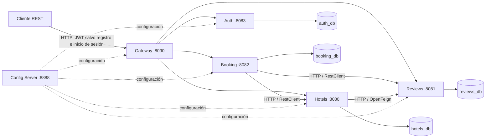

# StayBook

**Plataforma backend de reservas hoteleras construida con Java y Spring Boot.**

StayBook modela un flujo de reservas mediante microservicios independientes: catálogo de hoteles, disponibilidad y reservas, valoraciones y gestión de usuarios. El proyecto pone el foco en límites de servicio claros, comunicación HTTP, seguridad basada en JWT y contratos REST documentados con OpenAPI.

> Proyecto de portfolio en evolución. Esta documentación distingue las capacidades implementadas de los aspectos que aún requieren trabajo antes de un despliegue productivo.

## Funcionalidades

| Servicio | Responsabilidad |
|---|---|
| **Hotels Service** | Gestiona hoteles, ciudades y servicios; consulta reseñas para ofrecer detalles y valoraciones agregadas. |
| **Booking Service** | Consulta disponibilidad y gestiona la creación, consulta, confirmación y cancelación de reservas; usa el JWT para asignar el usuario y filtrar las consultas. |
| **Reviews Service** | Gestiona reseñas y proporciona consultas por hotel y resúmenes de valoraciones. |
| **Auth Service** | Registra usuarios, autentica credenciales, emite JWT y permite consultar o actualizar el perfil propio. |
| **Gateway Service** | Enruta las solicitudes a los servicios y comprueba los JWT de las rutas protegidas. |
| **Config Server** | Proporciona configuración externa a los servicios que usan Spring Cloud Config. |

## Arquitectura



Los servicios de dominio mantienen bases de datos PostgreSQL independientes. Las entidades JPA pertenecen a cada servicio; la comunicación entre ellos se realiza mediante HTTP, no mediante acceso compartido a sus bases de datos. Booking obtiene del JWT el usuario asociado a las reservas y usa esa identidad para filtrar las consultas.

El Gateway es el punto de entrada previsto para las API en local. Solo el registro y el inicio de sesión están exentos de JWT en el filtro del Gateway; las demás rutas requieren un token Bearer válido. El endpoint de importación de ciudades requiere además el rol `ROLE_ADMIN`.

## Tecnologías

- **Java 21**, **Spring Boot 3.5.5** y **Spring Cloud 2025.0.0**
- **Maven** como herramienta de compilación y gestión del reactor multimódulo
- **Spring Web**, **Spring Data JPA**, **Bean Validation** y **PostgreSQL**
- **Spring Security** y **JWT** para autenticación y autorización
- **Spring Cloud Gateway** para el enrutamiento de API
- **Spring Cloud OpenFeign** y **Spring `RestClient`** para comunicación HTTP entre servicios
- **Resilience4j** para tolerancia a fallos en llamadas remotas
- **Springdoc OpenAPI** para documentar los contratos REST
- **JUnit, Spring Boot Test y H2** para pruebas
- **GitHub Actions y SonarCloud** para análisis automatizado del proyecto

## Servicios y puertos locales

| Componente | Puerto | Base de datos |
|---|---:|---|
| Gateway Service | `8090` | — |
| Auth Service | `8083` | `auth_db` |
| Hotels Service | `8080` | `hotels_db` |
| Reviews Service | `8081` | `reviews_db` |
| Booking Service | `8082` | `booking_db` |
| Config Server | `8888` | — |

El detalle de rutas, métodos, autenticación y parámetros está en la [referencia de la API](./docs/api-end-point.md). La arquitectura y las responsabilidades de cada componente se describen en [docs/architecture.md](./docs/architecture.md).

## Compilar y ejecutar pruebas

### Requisitos

- JDK 21
- Maven 3.9 o posterior
- PostgreSQL para ejecutar localmente los servicios de dominio

Desde la raíz del repositorio, Maven puede compilar y probar todos los módulos:

```bash
mvn -B clean verify
```

Para trabajar en un módulo concreto:

```bash
mvn -pl booking-service test
```

Añade `-am` si también necesitas que Maven compile los módulos del reactor requeridos por el módulo seleccionado:

```bash
mvn -pl booking-service -am test
```

## Ejecución local

1. Inicia PostgreSQL y crea las bases `auth_db`, `hotels_db`, `booking_db` y `reviews_db`.
2. Inicia Config Server desde la raíz:

   ```bash
   mvn -pl configserver-service spring-boot:run
   ```

3. En terminales separadas, inicia los servicios:

   ```bash
   mvn -pl auth-service spring-boot:run
   mvn -pl hotels-service spring-boot:run
   mvn -pl reviews-service spring-boot:run
   mvn -pl booking-service spring-boot:run
   mvn -pl gateway-service spring-boot:run
   ```

Los servicios importan configuración del Config Server de forma opcional. Para conectarlos a otra instancia de PostgreSQL, configura `SPRING_DATASOURCE_URL`, `SPRING_DATASOURCE_USERNAME` y `SPRING_DATASOURCE_PASSWORD` para cada proceso, usando la base de datos correspondiente. Auth, Hotels, Booking y Gateway deben utilizar el mismo `JWT_SECRET` para emitir y validar tokens. No guardes secretos reales en el repositorio; consulta la [guía de configuración JWT](./docs/JWT-DEV.md).

> **Persistencia local:** la configuración actual usa `ddl-auto=create-drop` en Hotels, Booking y Reviews, y `ddl-auto=update` en Auth. No conectes esta configuración a datos que deban conservarse ni la consideres preparada para producción. Consulta [desarrollo y validación](./docs/development.md).

## Documentación interactiva

Con cada servicio iniciado, Swagger UI está disponible en:

| Servicio | URL local |
|---|---|
| Hotels | [http://localhost:8080/swagger-ui.html](http://localhost:8080/swagger-ui.html) |
| Booking | [http://localhost:8082/swagger-ui](http://localhost:8082/swagger-ui) |
| Reviews | [http://localhost:8081/swagger-ui.html](http://localhost:8081/swagger-ui.html) |
| Auth | [http://localhost:8083/swagger-ui.html](http://localhost:8083/swagger-ui.html) |

Los contratos OpenAPI fuente están organizados dentro de `src/main/resources/api/` en cada servicio.

## Automatización y estado del despliegue

El workflow de [SonarCloud](./.github/workflows/sonar.yml) ejecuta `mvn verify` y el análisis estático al actualizar `main` o abrir/actualizar un pull request. Para que el análisis remoto funcione, el repositorio debe tener configurado `SONAR_TOKEN` como secreto de GitHub Actions.

La contenerización es parcial: existen Dockerfiles para Hotels y Reviews, pero el repositorio no incluye un `docker-compose.yml` en la raíz que levante la plataforma completa con bases de datos y los seis servicios. Para desarrollo local, sigue los pasos de Maven anteriores.

Antes de un despliegue productivo todavía habría que definir, entre otros aspectos, migraciones versionadas de base de datos, gestión segura de secretos y una orquestación completa del entorno. Más notas y decisiones están en la carpeta [docs](./docs/).

## Autor

**Alejandro Moya Ruiz**

Desarrollo backend · Java · Spring Boot · Microservicios
